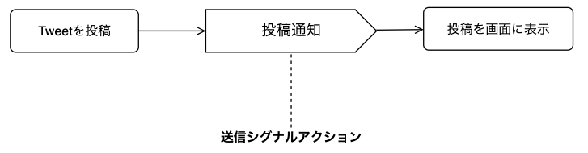
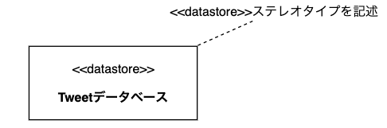
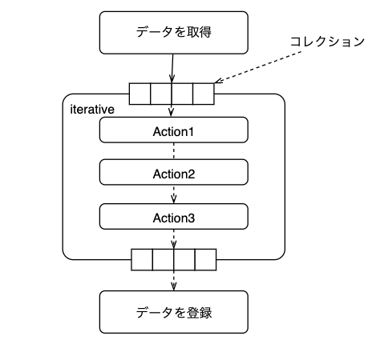
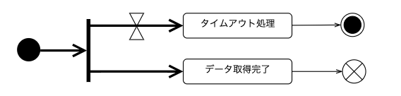
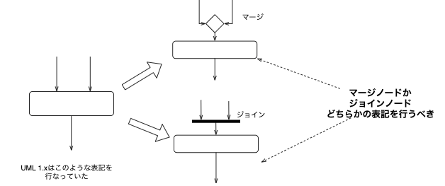

# 1. アクティビティ図（activity diagram）とは

- 処理の実行手順を表すダイアグラム
- フローチャートと近い直観的な記法
- *UMLに詳しくない人とでもコミュニケーションをとりやすい*
- 幅広い工程で利用
- 上流工程
  - **ビジネスプロセス**を分析しその流れを記述する
- 下流工程
  - **プログラムの詳細な制御フロー**を記述する


## 1.1. アクティビティ図で表すことのできる動作

- 開始ノードから終了ノードまでの一連の動作を矢印を用いて表現する
- 判断(if 文のこと)や並列処理
  - デシジョンノードやマージノード後述
  - フォークノードやジョインノード後述


# 2. アクティビティ図の構成要素
## 2.1. アクティビティ(activity)
ある一連の振る舞いをまとめたものです。

### 2.1.1. アクティビティの記法

- 単体のアクティビティ
  - 角が丸い長方形
  - 内部にアクティビティ名(動作名)

- 内部に詳細を記述する場合
  - 角が丸い長方形(activity frame)
  - 左上隅にアクティビティ名(動作名)
  - 中央にそのアクティビティを構成する要素


## 2.2. アクション
  - 振る舞いの原始的な単位
  - 内部に別のアクションやアクティビティを内包しない

  ### 2.2.1. アクションの記法
  - 角丸長方形
  - 内部にアクション名
  - 事前条件(localPreCondition)、事後条件(localPostcondition)
    - アクションに結びついたステレオタイプを記述

ここまでの説明からアクティビティとアクションは情報の粒度が異なるものであり、本質的なものとしては同じものと考えて良いです。


## 2.3. ノード
開始ノードと終了ノードが存在していて、一連の処理の開始、停止を表すものです。

 ### 2.3.1. ノードの記法
 - 開始ノード
   - 一連のアクティビティの処理を開始する地点
   - 黒い丸で記述
 - 終了ノード
 - 一連の処理が終了する地点
 - 2 種類の終了ノード
   - アクティビティ終了ノード
   - フロー終了ノード


#### 2.3.1.1. アクティビティ終了ノード
一連のアクティビティの全体が**完全に終了**したことを表す。
#### 2.3.1.2. フロー終了ノード
そのフローだけが終了したことを表す。
- 繰り返しの終了
- エラーによる異常終了など


## 2.4. コントロールフロー（control flow）
データのやりとりを行わない処理の実行の流れ
データのやりとりを行う場合は次節のオブジェクトフローを使います。


### 2.4.1. コントロールフローの記法
- アクティビティやアクションを結ぶ実線の矢印
  - 流れの方向を表す
- 直線の付近にコントロールフロー名を記述する


## 2.5. オブジェクトフロー(object flow)
アクティビティ間の情報の受け渡しを表す。
前ページのコントロールフローと区別して表現が可能です。

### 2.5.1. オブジェクトフローの記法
オブジェクトフローの記法は、 2 つ存在します。
- 受け渡すアクティビティ間にオブジェクトノードを配置し，その両端に流
れを表す矢印を記述します。
- ピンと呼ばれる表記によって表現する


#### 2.5.1.1. **Tips**

drawio には UML2.5 を使用できる。しかし、オブジェクトノードとアクティビティ・アクションは少し離れたところにあるので注意


## 2.6. デシジョンノード・マージノード
分岐や分岐区間の終了を表す。

- デシジョンノード条件によって複数（３以上も可）のフローに分岐させる．
- マージノード複数のフローを１つにまとめる．

### 2.6.1. デシジョンノード・マージノードの記法
- 白抜きの菱形
- 分岐されるコントロールフローにガード条件を記述
フローチャートにもこの白抜きの菱形が存在していて、同様に条件分岐を表す。


## 2.7. コネクタ
遠くのアクティビティ同志を繋ぐために用います。
フローが複雑になり、可読性が落ちる際に用いると良い。

二度寝の例を考えてみました。


## 2.8. フォークノードやジョインノード
- フォークノード
  -  １つのフローを複数に分け，並行に処理する．
- ジョインノード
  - 非同期に並行処理されてきたフローを同期をとって１つのフローにまとめる．マージノードと異なり，それらの並行フローがすべて揃ってから，次のアクティビティに進む．


## 2.9. アクティビティパーティション

アクティビティ図の要素をグループ化する要素のことです。
- アクティビティを実行する主体ごと
- フェーズごと
スイムレーンと呼ぶこともある。

### 2.9.1. アクティビティパーティションの表記法

- 長方形
- 内部にアクティビティなどを入れる
- 垂直方向と水平方向にも区分できる
- 各方向で多重構造を構成できる
- 


## 2.10. 例外ハンドラ
アクティビティ内で例外が発生したときに、それに対応するための処理を記述します。

### 2.10.1. 例外ハンドラの表記法
- 入力ピンがついたアクション
- 例外は発生したアクティビティとジグザグの矢印で接続
- 例外名を入力ピンのそばに記述


## 2.11. 受信イベントアクション
特定のイベントが起こるのを待機するノード
開始ノードの代わりにもなり、入力フローのない受信イベントアクションは常時待機を表します。

### 2.11.1. 受信イベントアクションの表記法
- 長方形のどちらかの端が三角形に窪んだ五角形
- 待機するイベント名を内部に記述
  


### 2.11.2. 時間情報を含んだ受信イベントアクション

受信イベントアクションには時間に関する情報も含めることが可能になっている
時間情報を含める場合、砂時計マークで表す。


入力フローのある砂時計はタイムアウトを表す。


## 2.12. 送信シグナルアクション
他のアクティビティなどからきた情報により，シグナルを作成して，それを送信するためのノードのことです。

### 2.12.1. 送信シグナルアクション表記法
- 長方形のどちらかの端が三角形に出っ張った五角形
- 送信するシグナルの型を内部に記述




## 2.13. データストアノード
データベースなどの，永続的にデータが保管できる対象を表すオブジェクトノードオブジェクトフローの元になるオブジェクトを取り出す場所になったり，フローによる処理を終えたオブジェクトを格納する場所のことです。

### 2.13.1. データストアノードの表記法
- 長方形
- ステレオタイプ<<datastore\>>の下に名前を記述
- 名前の下に角括弧で囲んで状態を記述





## 2.14. 拡張領域
- 複数の入力値を処理するために，その処理部分を囲った領域
- 複数の入力はリストなどのコレクション（同型の複数のデータの集まり）で与えられる
- コレクションの処理の仕方で３つのモードに分類できる
  - parallel　条件分岐があるとき
  - iterative コレクションを１つずつ取り出し, 1 つのコレクションの処理が全て終わった後に次のコレクションの処理に進む
  - stream 入力値に対してパイプライン的に処理を行う。例えば、Int 型のコレクションをソートして、フィルターをかけて、最後に残ったコレクションを 2 倍にする。のような処理

結果は同じでも、処理の仕方が異なるため、特にコードを書く人のためにもコレクションの処理の明記はあった方が良いです。

コードも一応載せておきます。


### 2.14.1. iterativeの例

```swift
func filter_map_sample() {
    let array = [1, 2 ,3, 4, 5]
    var result: [Int] = []
    //iterativeの例 コレクションのそれぞれの要素に対してアクションを行う。
    for i in array {
        if i.isMultiple(of: 2) {
            result.append(i * 3)
        }
            }

    print("iterative:",result)
}

filter_map_sample()


```

### 2.14.2. Streamの例

```swift streamの例

func filter_map_sample() {
    let array = [1, 2 ,3, 4, 5]
    //streamの例
    let hof = array
        .filter { $0 % 2 == 0 }
        .map { $0 * 3 }
    
    print("stream:",hof)
}

filter_map_sample()

```




--------------------------------

# 3. アクティビティ図に関する注意点

## 3.1. フォークとジョインについて

以下の図はタイムアウトによるエラーと正常終了を表しています。
フォークから出る処理は複数存在できるため、より表現の幅が広がります。
逆にフォークは入力を１つしか持つことができません。

- B が完了しなくても， A が完了すれば全体が終了
- A のフローが終了する前に B が完了すれば，その後で A を実行してから全体を終了できる。



## 3.2. マージとジョインについて

１つのアクティビティに複数のフローが入るような図を書きたくなったときは，それがマージとジョインのどちらであるのか，明示することを考える。
マージノードの特徴は、複数のアクションから最終的なアクションが同じ場合ということを表すことができます。
また、ジョインノードは、入力されたアクションが全て完了するまで待機するといった意味があります。
そのため、マージノードとジョインノードは意味が全く異なるため、使い分けることが重要です。




