# 1. アクティビティ図（activity diagram）とは

- 処理の実行手順を表すダイアグラム
- フローチャートと近い直観的な記法
- *UMLに詳しくない人とでもコミュニケーションをとりやすい*
- 幅広い工程で利用
- 上流工程
  - **ビジネスプロセス**を分析しその流れを記述する
- 下流工程
  - **プログラムの詳細な制御フロー**を記述する

## 1.1. アクティビティ図で表すことのできる動作

- 開始ノードから終了ノードまでの一連の動作を矢印を用いて表現する
- 判断(if 文のこと)や並列処理
  - デシジョンノードやマージノード後述
  - フォークノードやジョインノード後述

# 2. アクティビティ図の構成要素
## 2.1. アクティビティ(activity)
ある一連の振る舞いをまとめたものです。

### 2.1.1. アクティビティの記法

- 単体のアクティビティ
  - 角が丸い長方形
  - 内部にアクティビティ名(動作名)

- 内部に詳細を記述する場合
  - 角が丸い長方形(activity frame)
  - 左上隅にアクティビティ名(動作名)
  - 中央にそのアクティビティを構成する要素

## 2.2. アクション
  - 振る舞いの原始的な単位
  - 内部に別のアクションやアクティビティを内包しない

  ### 2.2.1. アクションの記法
  - 角丸長方形
  - 内部にアクション名
  - 事前条件(localPreCondition)、事後条件(localPostcondition)
    - アクションに結びついたステレオタイプを記述

ここまでの説明からアクティビティとアクションは情報の粒度が異なるものであり、本質的なものとしては同じものと考えて良いです。

## 2.3. ノード
開始ノードと終了ノードが存在していて、一連の処理の開始、停止を表すものです。

 ### 2.3.1. ノードの記法
 - 開始ノード
   - 一連のアクティビティの処理を開始する地点
   - 黒い丸で記述
 - 終了ノード
 - 一連の処理が終了する地点
 - 2 種類の終了ノード
   - アクティビティ終了ノード
   - フロー終了ノード

#### 2.3.1.1. アクティビティ終了ノード
一連のアクティビティの全体が**完全に終了**したことを表す。
#### 2.3.1.2. フロー終了ノード
そのフローだけが終了したことを表す。
- 繰り返しの終了
- エラーによる異常終了など

## コントロールフロー（control flow）
データのやりとりを行わない処理の実行の流れ
データのやりとりを行う場合は次節のオブジェクトフローを使います。

### コントロールフローの記法
- アクティビティやアクションを結ぶ実線の矢印
  - 流れの方向を表す
- 直線の付近にコントロールフロー名を記述する

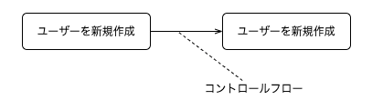

## オブジェクトフロー(object flow)
アクティビティ間の情報の受け渡しを表す。
前ページのコントロールフローと区別して表現が可能です。

### オブジェクトフローの記法
オブジェクトフローの記法は、 2 つ存在します。
- 受け渡すアクティビティ間にオブジェクトノードを配置し，その両端に流
れを表す矢印を記述します。
- ピンと呼ばれる表記によって表現する

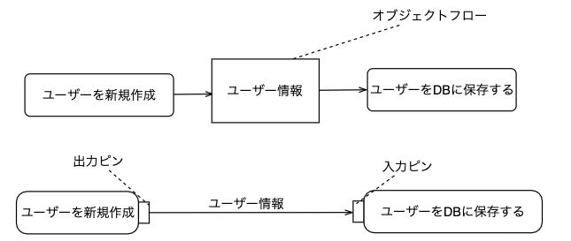

#### **Tips**

drawio には UML2.5 を使用できる。しかし、オブジェクトノードとアクティビティ・アクションは少し離れたところにあるので注意
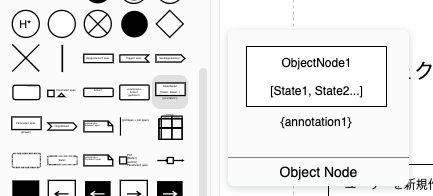

## デシジョンノード・マージノード
分岐や分岐区間の終了を表す。

- デシジョンノード条件によって複数（３以上も可）のフローに分岐させる．
- マージノード複数のフローを１つにまとめる．

### デシジョンノード・マージノードの記法
- 白抜きの菱形
- 分岐されるコントロールフローにガード条件を記述
フローチャートにもこの白抜きの菱形が存在していて、同様に条件分岐を表す。

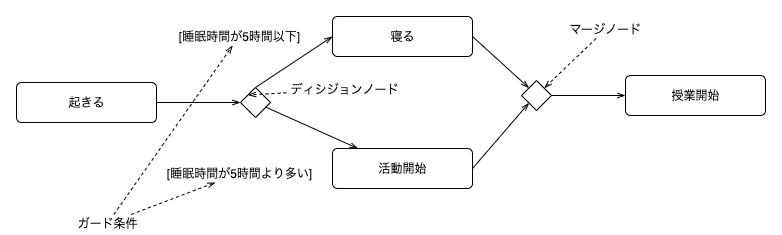

## コネクタ
遠くのアクティビティ同志を繋ぐために用います。
フローが複雑になり、可読性が落ちる際に用いると良い。

二度寝の例を考えてみました。

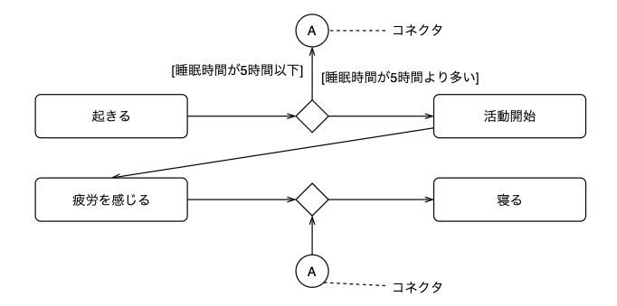

## フォークノードやジョインノード
- フォークノード
  -  １つのフローを複数に分け，並行に処理する．
- ジョインノード
  - 非同期に並行処理されてきたフローを同期をとって１つのフローにまとめる．マージノードと異なり，それらの並行フローがすべて揃ってから，次のアクティビティに進む．

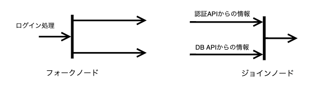

## アクティビティパーティション

アクティビティ図の要素をグループ化する要素のことです。
- アクティビティを実行する主体ごと
- フェーズごと
スイムレーンと呼ぶこともある。

### アクティビティパーティションの表記法

- 長方形
- 内部にアクティビティなどを入れる
- 垂直方向と水平方向にも区分できる
- 各方向で多重構造を構成できる
- 
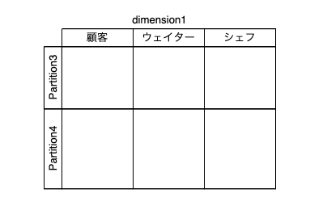

## 例外ハンドラ
アクティビティ内で例外が発生したときに、それに対応するための処理を記述

### 例外ハンドラの表記法
- 入力ピンがついたアクション
- 例外は発生したアクティビティとジグザグの矢印で接続
- 例外名を入力ピンのそばに記述

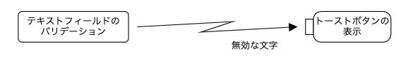

## 受信イベントアクション
特定のイベントが起こるのを待機するノード
開始ノードの代わりにもなり、入力フローのない受信イベントアクションは常時待機を表します。

### 受信イベントアクションの表記法
- 長方形のどちらかの端が三角形に窪んだ五角形
- 待機するイベント名を内部に記述
  
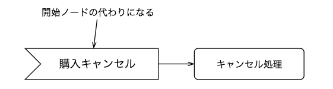

### 時間情報を含んだ受信イベントアクション

受信イベントアクションには時間に関する情報も含めることが可能になっている
時間情報を含める場合、砂時計マークで表す。

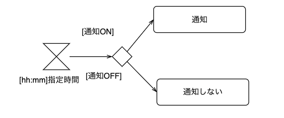

入力フローのある砂時計はタイムアウトを表す。

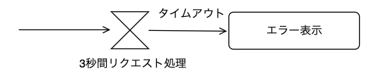
