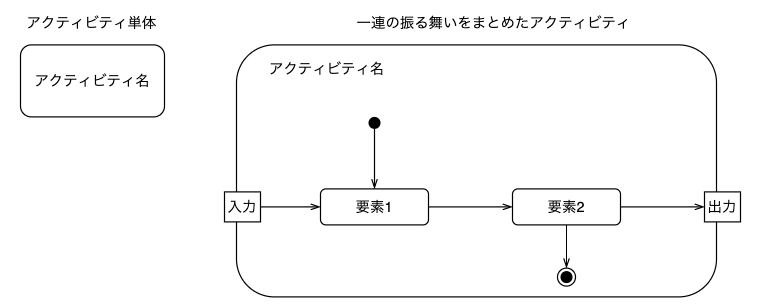
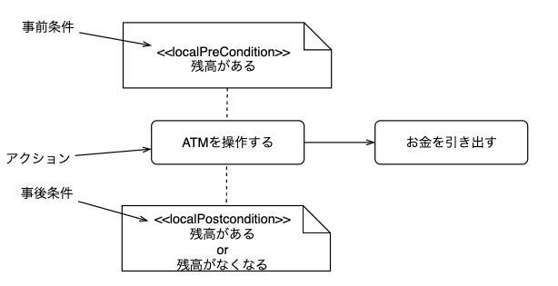
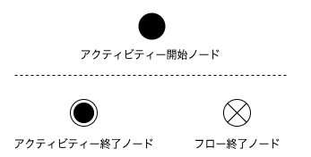
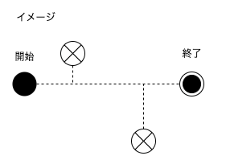

# アクティビティ図（activity diagram）とは

- 処理の実行手順を表すダイアグラム
- フローチャートと近い直観的な記法
- *UMLに詳しくない人とでもコミュニケーションをとりやすい*
- 幅広い工程で利用
- 上流工程
  - **ビジネスプロセス**を分析しその流れを記述する
- 下流工程
  - **プログラムの詳細な制御フロー**を記述する

## アクティビティ図で表すことのできる動作

- 開始ノードから終了ノードまでの一連の動作を矢印を用いて表現する
- 判断(if 文のこと)や並列処理
  - デシジョンノードやマージノード後述
  - フォークノードやジョインノード後述

# アクティビティ図の構成要素
## アクティビティ(activity)
ある一連の振る舞いをまとめたもの

### アクティビティの記法

- 単体のアクティビティ
  - 角が丸い長方形
  - 内部にアクティビティ名(動作名)

- 内部に詳細を記述する場合
  - 角が丸い長方形(activity frame)
  - 左上隅にアクティビティ名(動作名)
  - 中央にそのアクティビティを構成する要素

## アクション
  - 振る舞いの原始的な単位
  - 内部に別のアクションやアクティビティを内包しない

  ### アクションの記法
  - 角丸長方形
  - 内部にアクション名
  - 事前条件(localPreCondition)、事後条件(localPostcondition)
    - アクションに結びついたステレオタイプを記述

## ノード
開始ノードと終了ノードが存在していて、一連の処理の開始、停止を表すもの

 ### ノードの記法
 - 開始ノード
   - 一連のアクティビティの処理を開始する地点
   - 黒い丸で記述
 - 終了ノード
 - 一連の処理が終了する地点
 - 2種類の終了ノード
   - アクティビティ終了ノード
   - フロー終了ノード

#### アクティビティ終了ノード
一連のアクティビティの全体が**完全に終了**したことを表す。
#### フロー終了ノード
そのフローだけが終了したことを表す。
- 繰り返しの終了
- エラーによる異常終了など

## デシジョンノードやマージノードについて

## フォークノードやジョインノード
