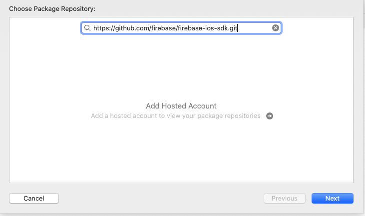
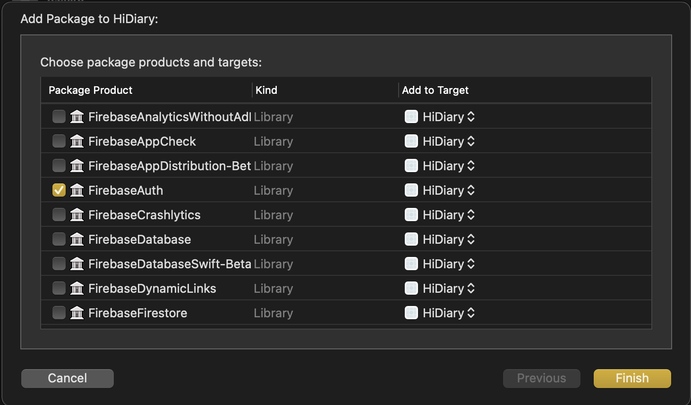

# はじめに

今回の記事は，Firebase Auth を使ってログイン画面を実装していきたいと思います．
使用するフレームワークは SwiftUI と MVVM を使用しています．
参考になれば幸いです．

# Firebase でプロジェクトを新規作成する

まず Firebase のアカウントを作成してください．
https://console.firebase.google.com/

プロジェクトの作成するをクリックすると， 3 手順が示されるため手順通りに作成してください．
手順に従うと，プロジェクトが作成されます．

# Xcode Project に Firebase のパッケージをインストール

Cocoa Pods がメジャーですが，Swift Package Manager(Swift PM) も使用できるので，今回は SwiftPM を使用します．

https://github.com/firebase/firebase-ios-sdk.git

FirebaseAuth パッケージをインストール

インストールが完了したら，一度，ブラウザの方に戻ってください．

## Firebase 上での操作

Authentication を選択して，始めるボタンをクリック

メールや電話番号，その他のログインプロバイダーを選択する画面が表示されます．
今回は，Google のログインを有効にする．

Google ログインを選択すると，プロジェクトの公開名とサポートメールが表示されるので任意のものを選択．

Google のステータスが有効になれば成功です．
