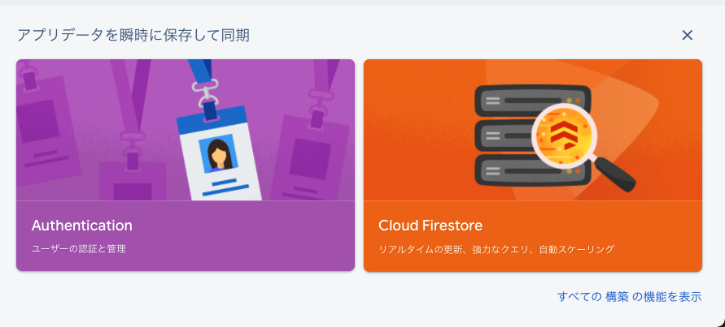

# 1. はじめに

今回の記事は，Firebase Auth を使ってログイン画面を実装します．
使用するフレームワークは SwiftUI と MVVM を使用しています．
参考になれば幸いです．

# 2. Firebase の操作

## 2.1. Firebase でプロジェクトを新規作成する

まず Firebase のアカウントを作成してください．
https://console.firebase.google.com/

プロジェクトの作成するをクリックすると， 3 手順が示されるため手順通りに作成してください．
手順に従うと，プロジェクトが作成されます．

## 2.2. iOS アプリへの Firebase の追加

Firebase のトップ画面から，iOS アプリを追加します．


1. アプリの登録
2. 設定ファイルのダウンロード
3. Firebase SDK の追加
   1. 今回は Swift PM を使用
4. 次のステップ
5. Firebase SDK の追加

1.2.の手順まで終わったら，3 のステップは無視します．
ダウンロードした GoogleService-Info.plist ファイルを Xcode プロジェクトのルートに移動し、 すべてのターゲットに追加します．

## 2.3. Google でログインを有効にする

Authentication を選択して，始めるボタンをクリック



メールや電話番号，その他のログインプロバイダーを選択する画面が表示されます．
今回は，Google のログインを有効にする．

Google ログインを選択すると，プロジェクトの公開名とサポートメールが表示されるので任意のものを選択．

Google のステータスが有効になれば成功です．

---

# 3. Xcode Project の操作

## 3.1. Xcode Project に Firebase のパッケージをインストール

Cocoa Pods がメジャーですが，Swift Package Manager(Swift PM) も使用できるので，今回は SwiftPM を使用します．

https://github.com/firebase/firebase-ios-sdk.git


FirebaseAuth パッケージをインストール


インストールが完了したら，一度，ブラウザの方に戻ってください．

## 3.2. 初期化コードの追加

Xcode Project に AppDelegate を使用しているならば，Fireabse の初期化コードをそのまま使用できます．

`AppDelegate.swift` ファイルがない場合，`SwiftUI App` でライフサイクルファイルを生成しているため，`アプリ名App.swift` ファイル内で以下のコードを追記してください．
`@UIApplicationDelegateAdaptor` を使用することで、既存の AppDelegate を利用できます．

```swift
import SwiftUI
import Firebase
@main
struct FirebaseAuthApp: App {

    @UIApplicationDelegateAdaptor(AppDelegate.self) var appDelegate //Add
    var body: some Scene {
    var body: some Scene {
        WindowGroup {
            ContentView()
        }
    }
}

//Add class AppDelegate
class AppDelegate: UIResponder, UIApplicationDelegate {
    func application(_ application: UIApplication, didFinishLaunchingWithOptions launchOptions: [UIApplication.LaunchOptionsKey : Any]? = nil) -> Bool {
        FirebaseApp.configure()
        return true
    }

}
```

実行できるか確認します．

参考文献:
https://dev.classmethod.jp/articles/xcode12_change_appdelegate/

## 3.3. 実装する

はじめにログイン画面の ViewModel を実装する．
