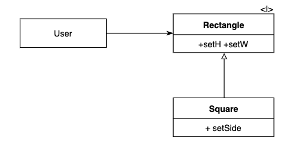

# クリーンアーキテクチャの用語まとめ

関心事の分離という同じ目的を持っている。

以下のような特性を持つシステムを生み出す。
- フレームワーク非依存
- テスト可能
- UI 非依存
- データベース非依存
  - SQL Server を Mongo や CoreData などの別のデータベースに置き換えることができること
- 外部エージェント非依存


- UseCase
- Repository
- Interactor
- Controller

- ビジネスロジック
  - システムにおける実際のロジック部分
  - 入力に対して処理を行い、View に反映させる部分やデータベースを更新する部分


## エンティティー Entities

エンティティーは最重要ビジネスルールをカプセル化したもの。エンティティーはメソッドを持ったオブジェクトやデータ構造、関数でも良い。重要なのは、さまざまなアプリケーション(単一の場合はアプリのビジネスオブジェクト)からそのエンティティーを使用できることです。
それは、もっとも一般的で最上位レベルのルールや外部が変化しても影響を受けないもののことです。
  - Enterprise Business Rules
  - ビジネスロジックを表現するレイヤー


## ユースケース UseCase
ユースケースのレイヤーには、アプリケーション固有のビジネスルールが含まれています。ここでは、全てのユースケースがカプセル化・実装されています。ユースケースの目標を達成できるようにエンティティーに入出力するデータの流れを調整し、ユースケースの目標を達成できるように、エンティティに最重要ビジネスルールを使用するように指示を出します。
  - Application Business Rules
  - ビジネスロジックの API
  - interface や抽象クラス


- ## インターフェイスアダプター Interface Adapters
ユースケースやエンティティーに便利なフォーマットからデータベースやウェブなどの外部エージェンとに便利なフォーマットにデータを変換するアダプタのことです。
例えば、GUI の MVC アーキテクチャの ViewController を保持するのはこのレイヤーで、つまり、プレゼンタやビュー、コントローラーはこのレイヤーに属しています。モデルはコントローラーからユースケースに渡され、ユースケースからプレゼンタやビューに戻されるデータ構造です。
同様に、このレイヤーでは、エンティティーやユースケースに便利な形式から、データベースに便利な形式としてデータを変換します。

  - Controllers
  - 入力、永続化、出力が所属
  - 単体テストクラスもここに所属

- UI,DB,ExternalInterface など
  - Frameworks & Drivers
  - UI もここに含まれる。つまり、このレイヤーは、誰からも依存されないため、どんな変更を行なってもその上のレイヤーはその変更を知らない。


## UseCaseの役割
>ユースケースとは、
>利用者があるシステムを用いて特定の目的を達するまでの、双方の間のやり取りを明確に定義したもの
>(https://e-words.jp/w/%E3%83%A6%E3%83%BC%E3%82%B9%E3%82%B1%E3%83%BC%E3%82%B9.htmlから引用)

UML でいうユースケース図で、アクター(人やシステム)が必要とする要件のこと。

## DIコンテナ
抽象化されたクラスに実際の具象化されたクラスを注入するためのものです。


## 依存性のルール
コードの依存性は外側から内側に向かっていなければならない.
円の内側は円の外側について何も知らない。円の外側から、内側に影響を及ぼしてはいけない。


## 依存関係逆転

ソースコードの依存関係と制御の流れは必ずしも同じでなくても良い。
依存の関係は UML の矢印で表すことができる。
ソースコードの依存関係はどこにあっても逆転できる。
システムにあるソースコードの依存関係の方向を絶対的に制御できる。
依存関係を制御の流れに合わせる必要がなくなる。


ビジネスルールを含むコンポーネントは UI やデータベースを含むコンポーネントに依存しない。
逆に UI と DB はビジネスルールに依存している。


### DIPを適用する場所
依存関係逆転を行うためには具象モジュールを使用しないことが重要です。
しかし、このルールを絶対的なものとして適応するのは現実的でなく、ソフトウェアシステムは数多くの具象に依存している。
String クラスなどは主な具象例であるが、このクラスは変更されることがほとんどない。そのため私たちはそのクラスについて意識しなくても良い。

依存したくないものはシステム内の変化しやすい具象要素です。開発中のモジュールや頻度に変更され続けているモジュールなどが当てはまります。


### DIPのルール
- 変化しやすい具象クラスを参照しない
- 変化しやすい具象クラスを継承しない
  - 静的型付け言語における継承はコードの依存関係の中でもっとも強力で厳格なものそのため十分に注意しながら使う必要がある。
- 具象関数をオーバーライドしない
  - 具象関数はソースコードの依存を要求することが多い。
- 変化しやすい具象を名指しで参照しない


## 関数型言語

関数型言語の特徴として、普遍性がある。

## 可変性の分離

サービスを可変コンポーネントと不変コンポーネントに分離することが１つのソフトウェアアーキテクトとして挙げられる。

- 不変コンポーネントは、可変変数を用いず、単純に関数のタスクを処理する。
- 可変コンポーネントは変数の状態の変化を許可している。

不変コンポーネントにできるだけ多くの処理を押し込み可変コンポーネントからできるだけ多くのコードを追い払うべきです。


## 設計の原則

### SOLID 原則についての説明
SOLID 原則は関数やデータ構図をどのようにクラスに組み込むのか、そして、クラスの相互接続をどのようにするかといったことを教えてくれる原則になっている。
この原則は、オフジェクト指向言語以外にも通用する。ここで言うクラスとは単にいくつかの機能やデータを取りまとめたものを指している。
SOLID 原則の目的は、以下のような性質を持つ中間レベルのソフトウェア構造（ミドルウェア）を作ることだ。

- 変更に強いこと
- 理解しやすいこと
- コンポーネントの基盤として多くのソフトウェアで利用できること。

「中間レベルの」という言葉は SOLID 原則がモジュールレベルの開発に使われるものであることを意図している。コードレベルよりも上に適応するものであり、モジュールやコンポーネントで使うソフトウェア構造の定義に役立つ。

つまりここでは中間レベルの設計について言及をする。しかしここでよくできた設計ができても全体として、ぐちゃぐちゃな設計になってしまうことがある。
SOLID 原則の説明が終わったら、それに対応するコンポーネントの原則について言及し、最後に上位レベルのアーキテクチャの原則を説明する。

## 単一責任の原則

モジュールはたった 1 つのアクターに対して責務を負うべきという原則のこと。
ここで言うモジュールとはソースファイルのことです。
また、いくつかの関数やデータをまとめた凝集性のあるもの。
凝集性が 1 つのアクターに対する責務を負うコードをまとめるフォースとなる。

## SRP の例

- 想定外の重複
- マージ

## 単一責任の原則まとめ

SRP は、関数や、クラスに関する原則であるが、同じような原則が別のレベルでも登場する。コンポーネントレベルでは、この原則は閉鎖性共通の原則 CCP と呼ばれるようになる。
また、アーキテクチャレベルでは「アーキテクチャの境界」を作るための「変更の軸」と呼ばれている。

## OCP: Open Closed Principle オープン・クローズドの原則

ソフトウェアの構成要素は拡張に対して開いており、修正に対しては閉じていなければならない。

言い換えれば、ソフトウェアの振る舞いは、既存の成果物を変更せず拡張できるようにすべきであると言うこと。

この原則は、クラスや関数にフォーカスされるが、コンポーネント単位で重要性を発揮する。

## 思考実験

財務情報を Web ページに表示するシステムを考える。

### 用語の整理

- <I> インターフェイス
- <DS> データ構造
- 通常の矢印は、使用の関係
- 白抜きの矢印は、実装や継承の関係

クラス A からクラス B に矢印が伸びている。
これはクラス A がクラス B に依存していることがわかる。つまり、クラス B はクラス A のことを一切知らない。


コンポジット図やコンポーネント図の要求インターフェイスと提供インターフェイスは、どちらが上位レベルなのかについて言及している図ではないので注意。
データがどちらからどちらに流れていくのかについて言及されている。


## リスコフの置換原則 Liskov substitution principle


派生元の型（基底型）と派生先の型（派生型）の間に成り立っていなければならない規則性のことです。

Billing アプリケーションは License のことだけを知っており、それを継承している Personal License と Business License を使うことができる。
これはリスコフの置換原則(LSP)を満たしている。



この例では Square は Rectangle の適切な派生系ではない。

```swift
var r: Rectangle = Square();
r.setH(2)
r.setW(5)
assert(r.area() == 10)
```

正方形なのに高さと幅が異なっているのはおかしい。
これらの型は置換可能でない。

## LSP とアーキテクチャ

LSP(リスコフの置換原則) は継承の使い方のみならず、インターフェイスと実装に関するソフトウェア設計の原則になっている。
>S が T の派生型であれば、プログラム内で T 型のオブジェクトが使われている箇所は全て S 型のオブジェクトで置換可能
>Wikipediaから引用

正方形と長方形の例はリスコフの置換原則を理解するのにはとても良い例です。

