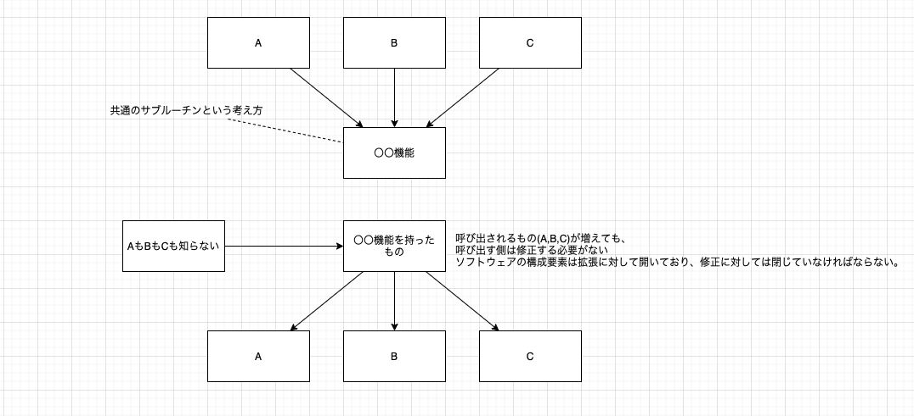

# オブジェクト指向プログラミングで重要な3性質

- カプセル化
- 継承
- ポリモーフィズム

## カプセル化

カプセル化は、クラスの宣言と定義を分離することです。

## 継承

```swift

func abstructPolymorphism() {

    class Animal {
        func greeting() -> String {
            return "";
        }
    }


    class Cat: Animal {
        override func greeting() -> String {
            return "にゃあー"
        }
    }

    class Dog: Animal {
        override func greeting() -> String {
            return "ワン！"
        }
    }

    let catAndDog = [
        Cat(),
        Dog()
    ]

    catAndDog.forEach { animal in
        print(animal.greeting())
    }


}

abstructPolymorphism()

```


## ポリモーフィズムについて
呼び出す側を共通化するポリモーフィズム。
ポリモーフィズムは、共通メインルーチンを作るための仕組みと言える。



下の図が共通メインルーチンとなっている。


# まとめ
- カプセル化(クラス化)
  - サブルーチンと変数をまとめてソフトウェア開発を行う
- 継承
  - 重複するクラスの定義を共通化する
- ポリモーフィズム
  - メソッドを呼び出す側を共通化する

